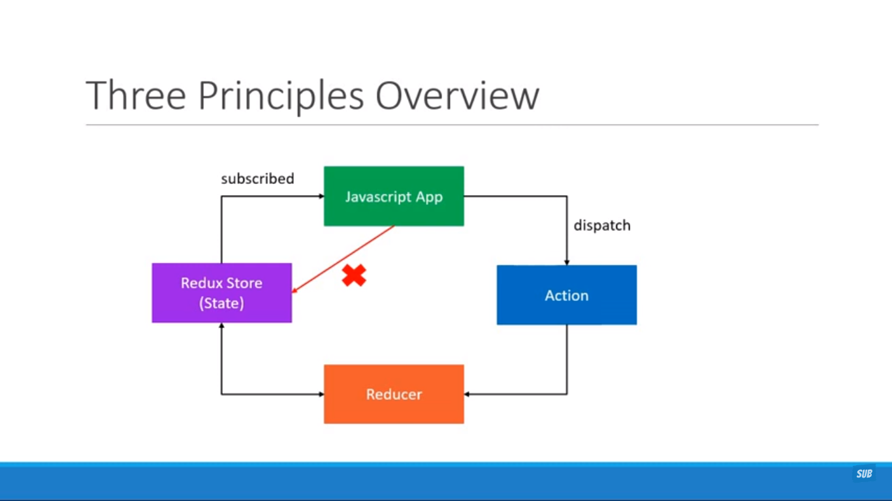

#### Redux:

- A state management library of javascript that can be used with react, vues, and angular or any other js library or frameworks
- A Redux is used to manage predictable state
- this help to avoid prop drealing in our projects or components
- without this we need to use props lifting( if props required in child component then we need to use that props from parent to child to make use of it.)
- without redux we need to pass through all the component in the hirarchy even that components don't required

#### React-Redux:

- A library that use to bind both react and redux into an application
- it has set of functions that help to manage state effectively.

#### Three Core Concept of Redux:

1. Store - A central store of states
2. Action - Describe what happens
3. Reducer - Tied Store and Action Together

#### Three Core Principles:

1. The **State** of Your whole **Application** is stored in an object tree within a single store.

2. The only way to change state is to emit action, an object describing what happened

3. To Specify how the state tree is transformed by actions, You write pure reducers.

#### overview:

- how state changes in Application:
  

- If app want to change state of any variable then app directly can't update the state as state has **read only** property.

- to update state application will **dispatch** the associated actions --> action will call associated **reducer** then reducer will update the store in the central store --> all the components subscribe/ contain that state variable will re-render and update
